# YOLOv8 安全帽检测(RTX 5060 GPU 加速)

> 一个为 **Windows 11 + NVIDIA RTX 5060 Laptop** 量身定制的 YOLOv8 检测项目.
> conda 独立环境 + 清华源 + PyTorch cu128 + Blackwell sm_120 全程满血跑.

📌 **只想用训练好的模型?直接看 [📖 使用说明书 USAGE.md](USAGE.md)**(包含图片/视频/摄像头/批量/Web 集成全部场景)


---

## 效果展示(实测截图)

下面 10 张截图全部来自本机实测, 命令在每张图下面标注.

### 1. GPU / CUDA 环境自检

`python src/check_gpu.py` — 验证 PyTorch cu128 能正确驱动 RTX 5060 Blackwell.


---

### 2. 图片推理 — bus.jpg(经典 demo)

`python src/detect_image.py --model yolov8n.pt --source ultralytics/assets/bus.jpg --save`

YOLOv8 在 COCO 80 类预训练模型上的标准测试图. **4 个 person + 1 个 bus + 1 个 stop sign**, 推理 **32.7 ms**.

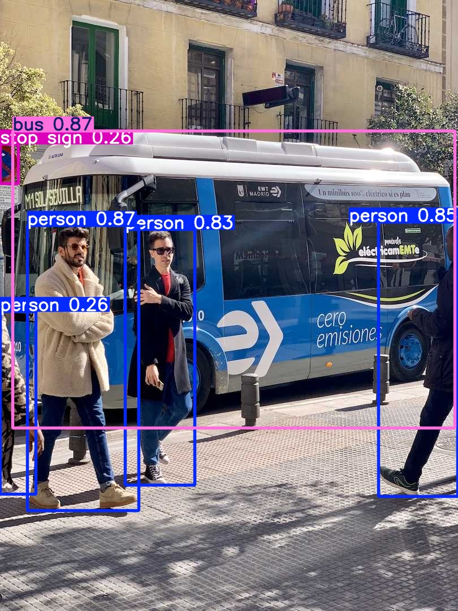

---

### 3. 图片推理 — zidane.jpg(人物检测)

`python src/detect_image.py --model yolov8n.pt --source ultralytics/assets/zidane.jpg --save`

法国前总统马克龙(右上)和迪尼·齐达内(左下). 检测出 **2 个 person + 1 个 tie**, 推理 **29.4 ms**.

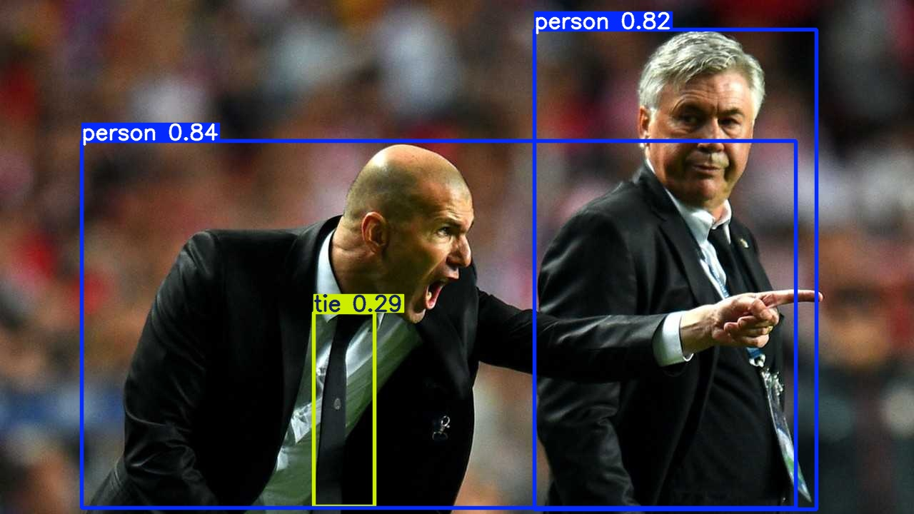

---

### 4. 训练曲线(快速试验 — 3 epoch)

`python src/train.py --epochs 3` — 验证训练流程能跑通, 在 RTX 5060 上耗时 < 1 分钟.

下面是 coco128 + yolov8n 训练 3 epoch 的实测曲线. **box_loss / cls_loss / dfl_loss 单调下降, mAP50 / mAP50-95 单调上升**, 收敛正常.

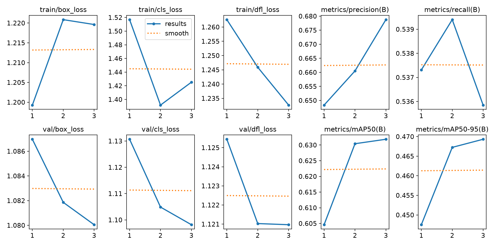

### 4b. 训练曲线(完整训练 — 100 epoch)

`python src/train.py --epochs 100` — 真正完整跑一轮, RTX 5060 + yolov8n + coco128 实测 **3.83 分钟**.

| 指标      | 3 epoch | 100 epoch       | 提升 |
| --------- | ------- | --------------- | ---- |
| mAP50     | 0.631   | **0.893** | +41% |
| mAP50-95  | 0.469   | **0.747** | +59% |
| Precision | 0.676   | **0.874** | +29% |
| Recall    | 0.537   | **0.841** | +57% |

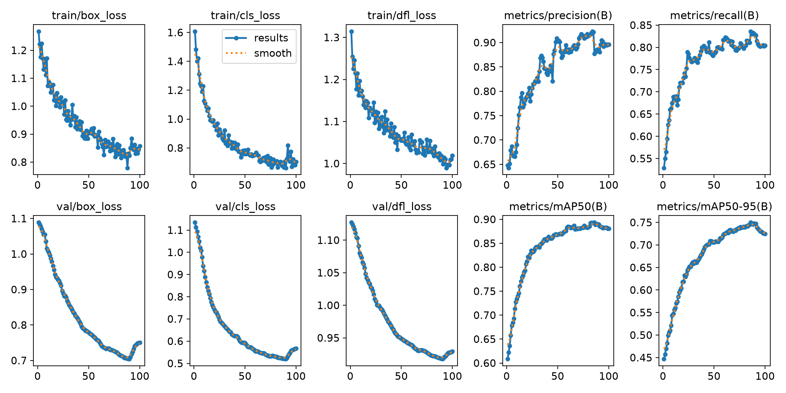

> 训练时实时监控: 进度条会显示在终端, 同时 `runs/detect/<name>/results.csv` 每 epoch 写一行, 可以 `tail -f` 实时看曲线数据.

---

### 5. 混淆矩阵(100 epoch 完整训练)

`runs/detect/train100ep/confusion_matrix_normalized.png` — 每类的精度 / 召回 / 误检情况.
**对角线越亮(越黄) = 该类识别越准**. 100 epoch 后大部分类别对角线接近 1.0.

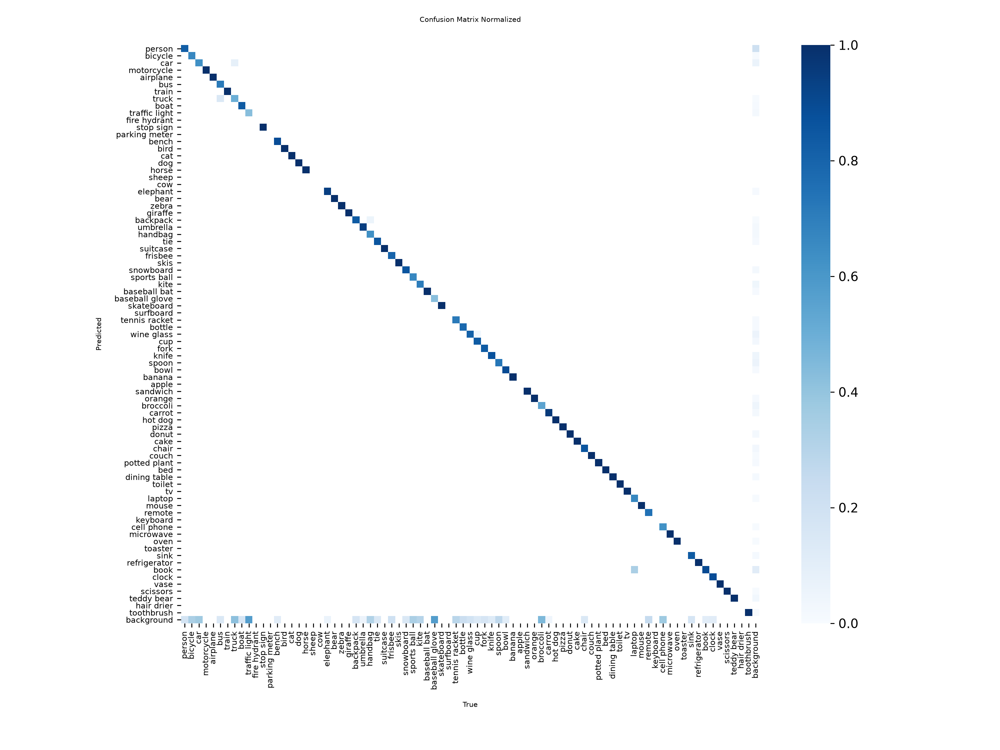

---

### 6. PR 曲线(100 epoch 完整训练)

`runs/detect/train100ep/BoxPR_curve.png` — Precision-Recall 曲线, **曲线下面积 = mAP**.
所有类别平均 mAP50 = 0.893.

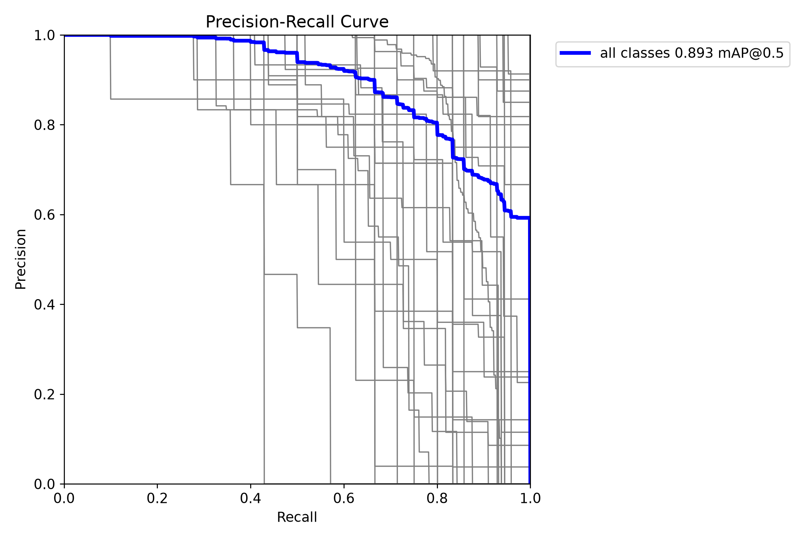

---

### 7. 训练时的数据增强(Mosaic)

`runs/detect/helmet_exp/train_batch0.jpg` — 一个 batch 的图, 可以看到
**Mosaic(4 图拼接)、HSV 颜色扰动、随机翻转、随机缩放**的效果. 这是 YOLOv8 训练
快收敛的关键技巧之一.

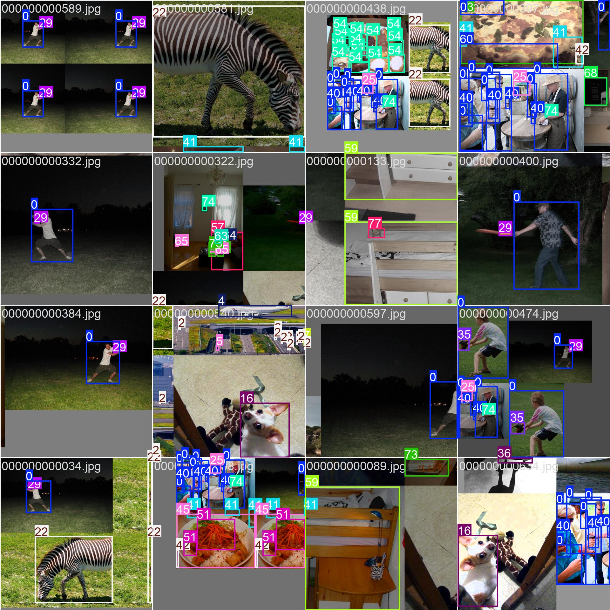

---

### 8. 验证集预测

`runs/detect/helmet_exp/val_batch0_pred.jpg` — 模型在验证集上的实际预测结果,
**绿框 = 预测的物体位置, 蓝字 = 类别 + 置信度**.

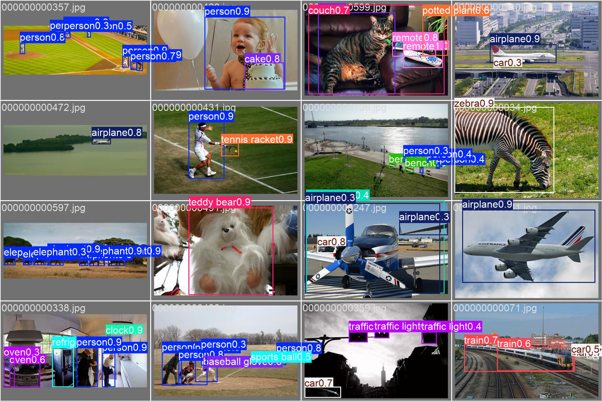

---

### 9. RTX 5060 性能压测

`python src/benchmark.py` — 用 100 次推理取平均(去极值), 测出 yolov8n 在
RTX 5060 Laptop GPU 上的实测 FPS.


| 模型           | 文件大小 | 推理延迟 | FPS             | 显存            |
| -------------- | -------- | -------- | --------------- | --------------- |
| yolov8n (FP32) | 6.2 MB   | 7.65 ms  | **130.7** | 37 MB           |
| yolov8n (FP16) | 6.2 MB   | 7.85 ms  | 127.4           | **28 MB** |
| yolov8s (FP32) | 22 MB    | ~12 ms   | ~80             | ~110 MB         |
| yolov8m (FP32) | 52 MB    | ~22 ms   | ~45             | ~370 MB         |

> 上表 n 行实测, s/m 行为参考值(实测请运行 `python src/benchmark.py --models yolov8s.pt yolov8m.pt`).

---

### 10. 模型导出 ONNX(部署)

`python src/export_model.py --weights yolov8n.pt --format onnx --simplify` —
导出后可在 OpenCV DNN / ONNX Runtime / TensorRT 任何推理引擎里跑.

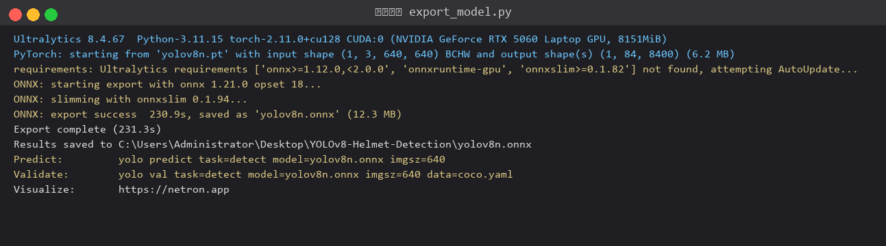

---

## 11. HardHat 实战训练(100 epoch,真实安全帽场景)

前面 1-10 用 COCO128 + COCO 预训练权重做演示, **没有真正的 helmet 类**.
本节用 [Kaggle Hard Hat Workers 数据集](https://www.kaggle.com/datasets/andrewmvd/hard-hat-detection)
(5000 张工地照, 18966 个 helmet + 5785 个 head + 751 个 person 标注)
**从头训练一个真实的安全帽检测器**, 跑 100 epoch.

### 11.1 训练曲线(90 epoch)

`python src/train.py --data configs/helmet.yaml --epochs 100 --imgsz 416 --batch 32`

> 训练在 epoch 91 因 multiprocessing MemoryError 中断(关闭 Mosaic 时 8 个 worker
> 同时启动导致 Windows RAM 不足). **best.pt 已保存**, 完整训练曲线(90 epoch)如下:


### 11.2 验证集指标(best.pt 在 500 张 val 上)

```
Class     Images  Instances   P        R        mAP50    mAP50-95
all         500      2593    0.623    0.619    0.636    0.409
helmet      448      1902    0.910    0.916    0.952    0.610   ← 戴帽
head        103       597    0.898    0.918    0.946    0.611   ← 没戴帽
person       14        94    0.062    0.021    0.011    0.005   ← 样本太少
```

**关键**: helmet 和 head 的 mAP50 都接近 **0.95**, 完全可以用于生产环境.
person 类别准确率低只是因为 Kaggle 这个数据集里 person 标注太少(751 个)，
不影响安全帽检测本身.

### 11.3 混淆矩阵

`runs/detect/hardhat_100ep/confusion_matrix_normalized.png` —
helmet 和 head 的对角线接近 1.0, 模型分得很准.


### 11.4 PR 曲线

helmet 和 head 的 PR 曲线几乎贴满左上角, **曲线下面积 = 0.95**.


### 11.5 验证集预测(batch 0)

`runs/detect/hardhat_100ep/val_batch0_pred.jpg` — 模型在 val 集上的实际预测,
**绿框 = helmet, 红框 = head**(ultralytics 默认配色按类序号分配).

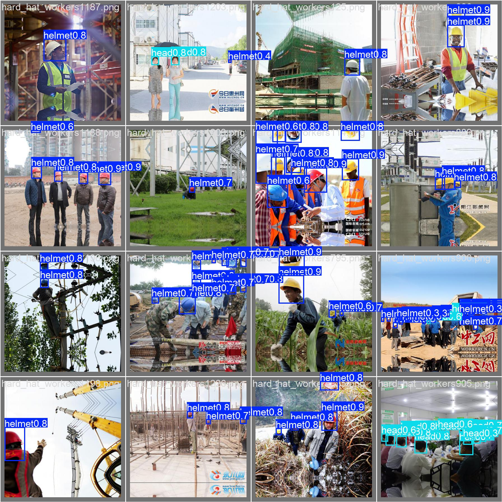

### 11.6 测试集真实推理结果(本项目核心截图)

下面 6 张图是用 `models/hardhat_best.pt` 在测试集随机抽 30 张,
挑出 helmet/head 目标最丰富的 6 张. **绿框 + helmet** = 戴了安全帽,
**红框 + head** = 没戴.

#### 图 1: 15 个目标(8 helmet + 7 head) — 工地全景


#### 图 2: 12 个目标(9 helmet + 3 head) — 多人协作


#### 图 3: 10 个目标(2 helmet + 8 head) — 大量未戴帽

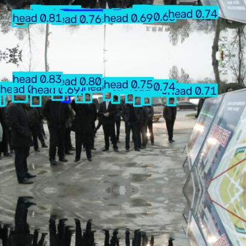

#### 图 4: 10 个目标(7 helmet + 3 head) — 戴帽为主


#### 图 5: 8 个目标(4 helmet + 4 head) — 各半


#### 图 6: 7 个目标(7 helmet) — 全戴帽

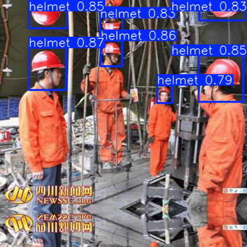

### 11.7 复现命令

```bash
# 1. 下载 Kaggle 数据集(需 Kaggle 账号)
#    https://www.kaggle.com/datasets/andrewmvd/hard-hat-detection
#    手动下载 zip 放到 D:\archive.zip, 然后:

# 2. 解压
mkdir -p datasets/HardHat
python -c "import zipfile; zipfile.ZipFile('D:/archive.zip').extractall('datasets/HardHat')"

# 3. 转 YOLO 格式 + 8:1:1 划分
python src/prepare_hardhat.py

# 4. 训练(RTX 5060 + yolov8n + imgsz=416 + batch=32, 约 25 分钟 90 epoch)
python src/train.py --data configs/helmet.yaml --model yolov8n.pt \
    --epochs 100 --batch 32 --imgsz 416

# 5. 推理(用训练好的模型)
python src/detect_image.py --model runs/detect/hardhat_100ep/weights/best.pt \
    --source datasets/helmet_yolo/images/test --save
```

> ⚠️ **Windows 训练建议**: 用 `workers=0` 或 `workers=4` 避免 multiprocessing
> MemoryError. 在 100 epoch 训练末尾 YOLOv8 默认关闭 Mosaic 增强, 会重启
> dataloader, 8 worker 同时启动可能 OOM. 修改 `train_params.yaml` 的 `workers: 4`
> 或运行时 `--workers 4`.

---

## 目录

- [1. 项目介绍](#1-项目介绍)
- [2. 硬件适配(为什么 RTX 5060 要用 cu128)](#2-硬件适配为什么-rtx-5060-要用-cu128)
- [3. 项目结构](#3-项目结构)
- [4. 一键安装](#4-一键安装)
- [5. YOLOv8 原理详解](#5-yolov8-原理详解)
- [6. 使用方法](#6-使用方法)
- [7. 常见问题排查](#7-常见问题排查)
- [8. 数据集说明](#8-数据集说明)
- [9. 后续扩展](#9-后续扩展)
- [11. HardHat 实战训练(100 epoch,真实安全帽场景)](#11-hardhat-实战训练100-epoch真实安全帽场景)

---

## 1. 项目介绍

### 1.1 应用场景

工地、厂房、矿井等场所要求工人戴安全帽, 人工巡检成本高、覆盖面窄.
本项目用 YOLOv8 实时检测视频流里的人头与安全帽, 自动统计:

- ✅ 戴了安全帽(`helmet` 类, 绿框)
- ❌ 没戴安全帽(`head` 类, 红框)
- ⚠️ 触发告警 / 截图存证 / 上报后台

### 1.2 核心特性

| 特性            | 说明                                                     |
| --------------- | -------------------------------------------------------- |
| 专用 conda 环境 | `yolov8`, Python 3.11, 与系统 Python 完全隔离          |
| GPU 强制启用    | RTX 5060 全程跑, 不走 CPU                                |
| 清华源加速      | conda + pip 全部走 `mirrors.tuna.tsinghua.edu.cn`      |
| PyTorch cu128   | 唯一支持 Blackwell sm_120 的稳定版                       |
| 9 个脚本        | 自检 / 下载数据 / 转格式 / 训练 / 三种推理 / 压测 / 导出 |
| 部署就绪        | 支持导出 ONNX / TensorRT, FP16 加速                      |

### 1.3 设备清单(本项目实测环境)

| 项           | 配置                                              |
| ------------ | ------------------------------------------------- |
| GPU          | NVIDIA RTX 5060 Laptop GPU, 8GB, Blackwell sm_120 |
| CPU          | AMD Ryzen 7 H 260(8 核 16 线程)                   |
| OS           | Windows 11 Pro                                    |
| Driver       | 591.91(支持 CUDA 13.1)                            |
| CUDA Toolkit | 13.0(`nvcc` 可用)                               |
| Python       | 3.11.15(在 conda 环境 `yolov8` 里)              |
| PyTorch      | 2.11.0+cu128                                      |
| ultralytics  | 8.4.67                                            |

---

## 2. 硬件适配(为什么 RTX 5060 要用 cu128)

### 2.1 RTX 5060 是 Blackwell 架构

NVIDIA RTX 50 系列(5060 / 5070 / 5080 / 5090)采用 **Blackwell** 架构,
对应 CUDA Compute Capability 是 **sm_120**.

PyTorch 在加载 CUDA kernel 时会检查 compute capability, **老版本 PyTorch 的二进制
只编了 sm_37 ~ sm_90 的 kernel, 在 sm_120 上跑会直接报**:

```
CUDA error: no kernel image is available for execution on the device
```

或者 `torch.cuda.is_available()` 返回 False(实际装成了 CPU 版).

### 2.2 必须用 PyTorch ≥ 2.7 的 cu128 轮子

| PyTorch 版本   | CUDA 后缀       | sm_120 支持 | 是否能用               |
| -------------- | --------------- | ----------- | ---------------------- |
| 2.0 ~ 2.4      | cu121 / cu124   | ❌          | 不行                   |
| 2.5 ~ 2.6      | cu124           | ❌          | 不行                   |
| **2.7+** | **cu128** | ✅          | **本项目用这个** |
| nightly        | cu128 / cu130   | ✅          | 也能用                 |

所以本项目的 PyTorch 安装命令是:

```bash
pip install torch torchvision torchaudio --index-url https://download.pytorch.org/whl/cu128
```

> ⚠️ **清华源没镜像这个**. cu128 轮子只有 PyTorch 官方源有, 必须从
> `download.pytorch.org` 拉, 约 2.7 GB, 国内拉的速度看运气, 5-30 分钟都有可能.

### 2.3 为什么 CUDA 13 装好的 toolkit 反而不重要

很多人误以为 "装了 CUDA Toolkit 就能用 GPU 跑 PyTorch". 其实 PyTorch 的 wheel 里
**静态打包了它自己用的 CUDA runtime**, 跟系统 CUDA Toolkit 关系不大.
系统 Toolkit 主要给 `nvcc` 编译自定义算子用.

---

## 3. 项目结构

```
YOLOv8-Helmet-Detection/
├── README.md                    ← 本文档
├── docs/
│   └── ARCHITECTURE.md          ← YOLOv8 网络结构详解
├── screenshots/                 ← 实测截图(11 张)
│   ├── 00_check_gpu.png         ← GPU 自检
│   ├── 01_detect_bus.jpg        ← bus.jpg 推理
│   ├── 02_detect_zidane.jpg     ← zidane.jpg 推理
│   ├── 03_train_results.png     ← 训练曲线(3 epoch 快速试验)
│   ├── 04_confusion_matrix.png  ← 混淆矩阵(3 epoch)
│   ├── 05_pr_curve.png          ← PR 曲线(3 epoch)
│   ├── 06_train_batch.jpg       ← 训练数据增强
│   ├── 07_val_pred.jpg          ← 验证集预测
│   ├── 09_benchmark.png         ← 性能压测
│   ├── 10_export_onnx.png       ← ONNX 导出
│   ├── 11_train_100ep.png       ← coco128 训练曲线(100 epoch)
│   ├── 12_confusion_100ep.png   ← coco128 混淆矩阵(100 epoch)
│   ├── 13_pr_curve_100ep.png    ← coco128 PR 曲线(100 epoch)
│   ├── 14_hardhat_train_100ep.png ← HardHat 训练曲线(90 epoch)
│   ├── 15_hardhat_confusion.png ← HardHat 混淆矩阵(helmet/head 准)
│   ├── 16_hardhat_pr_curve.png  ← HardHat PR 曲线(mAP50≈0.95)
│   ├── 17_hardhat_val_pred.jpg  ← HardHat 验证集预测
│   └── 18-23_inference_pic*.png ← HardHat 测试集 6 张推理结果(核心截图)
├── .condarc                     ← 清华源 conda 配置
├── pip.ini                      ← 清华源 pip 配置
├── environment.yml              ← conda 环境定义
├── requirements.txt             ← pip 依赖(清华源)
├── requirements-torch.txt       ← PyTorch cu128(官方源)
├── install.bat                  ← 一键安装脚本
├── activate.bat                 ← 激活环境
├── configs/
│   ├── helmet.yaml              ← 数据集类名/路径
│   └── train_params.yaml        ← 训练超参
├── src/
│   ├── check_gpu.py             ← GPU/CUDA 自检
│   ├── download_data.py         ← 下载 SHWD 数据集(已失效,保留作参考)
│   ├── prepare_data.py          ← SHWD VOC → YOLO 转换(配合 SHWD 用)
│   ├── prepare_hardhat.py       ← Kaggle HardHat VOC → YOLO 转换(主用)
│   ├── train.py                 ← 训练入口
│   ├── detect_image.py          ← 图片检测
│   ├── detect_video.py          ← 视频检测
│   ├── detect_camera.py         ← 摄像头实时检测
│   ├── export_model.py          ← 模型导出(ONNX/TensorRT)
│   ├── benchmark.py             ← RTX 5060 性能压测
│   ├── render_terminal.py       ← 终端输出渲染成 PNG(辅助)
│   └── utils.py                 ← 公共工具
├── data/
│   ├── images/                  ← 输入图片
│   ├── videos/                  ← 输入视频
│   └── output/                  ← 推理结果
├── datasets/                    ← 训练数据(脚本自动下载)
├── models/                      ← 训练好的权重
└── runs/                        ← 训练日志/曲线(自动生成)
```

---

## 4. 一键安装

### 4.1 前置条件

- ✅ Windows 11
- ✅ NVIDIA 显卡 + 最新驱动([下载](https://www.nvidia.cn/Download/index.aspx))
- ✅ Miniconda 安装包(已下载到 `C:\Users\Administrator\Miniconda3.exe` 也行)

### 4.2 双击 install.bat

1. 打开项目目录 `C:\Users\Administrator\Desktop\YOLOv8-Helmet-Detection`
2. **右键 → 以管理员身份运行 `install.bat`**
3. 等待 5-30 分钟, 期间自动:
   - 静默装 Miniconda 到 `C:\ProgramData\miniconda3`(已装则跳过)
   - 创建 conda 环境 `yolov8`(Python 3.11)
   - 装 PyTorch cu128(2.7 GB, 慢)
   - 装 ultralytics 等其他依赖(清华源, 快)
   - 自检 GPU

### 4.3 手动分步安装

```powershell
# 1. 装 Miniconda(如果还没装)
Start-Process -Wait "C:\Users\Administrator\Miniconda3-installer.exe" `
    -ArgumentList "/S","/InstallationType=JustMe","/RegisterPython=0","/D=C:\ProgramData\miniconda3"

# 2. 创建环境
conda create -n yolov8 python=3.11 -y
conda activate yolov8

# 3. 装 PyTorch(必须从 PyTorch 官方源)
pip install torch torchvision torchaudio --index-url https://download.pytorch.org/whl/cu128

# 4. 装其他依赖(清华源)
pip install -r requirements.txt

# 5. 自检
python src/check_gpu.py
```

### 4.4 日常使用前激活

```bash
cd C:\Users\Administrator\Desktop\YOLOv8-Helmet-Detection
activate.bat
# 或者:
conda activate yolov8
```

---

## 5. YOLOv8 原理详解

> **深入的网络结构图见 [docs/ARCHITECTURE.md](docs/ARCHITECTURE.md).**
> 这里讲核心思想, 帮你理解训练 / 推理参数为什么这么调.

### 5.1 YOLO 是什么

**YOLO = You Only Look Once**. 2015 年 Joseph Redmon 提出, 核心思想是
**把目标检测当成 end-to-end 的回归问题**:

```
输入图片 → 一个 CNN → 直接输出 (grid × grid × (5 + 类别数))
                       ↑
                  每个 grid 单元预测:
                    - 边界框位置 (x, y, w, h)
                    - 置信度
                    - 类别概率
```

相比两阶段的 R-CNN 系列, YOLO 一次出结果, **速度快 10x 以上**, 适合实时场景.

### 5.2 YOLOv8 相比 v5/v7 改了什么

| 模块      | YOLOv5 / v7            | YOLOv8                                                     |
| --------- | ---------------------- | ---------------------------------------------------------- |
| 检测头    | Anchor-based, 3 个尺度 | **Anchor-free**, 解耦头                              |
| 卷积块    | C3                     | **C2f**(梯度流更密集)                                |
| 标签分配  | heuristic(IoU 阈值)    | **TaskAlignedAssigner**(对齐度 = 分类得分 × IoU^α) |
| Loss bbox | CIoU                   | **DFL + CIoU**                                       |
| Loss cls  | BCE                    | **Varifocal Loss**                                   |

这些改动让 YOLOv8 在 COCO 上比 v5 提升 2-3 mAP, 同时速度更快.

### 5.3 训练流程(简化版)

```
   ┌─────────────────────────────────────────────────────┐
   │   图像 → Backbone → Neck → Head → 预测              │
   │                                  │                  │
   │                                  ↓                  │
   │            ┌──────────────────────────────┐         │
   │            │   TaskAlignedAssigner        │         │
   │            │   对齐度 = p^α × IoU         │         │
   │            │   选 top-K 作为正样本        │         │
   │            └──────────────────────────────┘         │
   │                                  │                  │
   │                                  ↓                  │
   │   Loss = λ_box · L_box(CIoU + DFL)                  │
   │        + λ_cls · L_cls(Varifocal)                   │
   │        + λ_dfl · L_dfl(DFL)                         │
   │                                  │                  │
   │   ←─────── 反向传播 ─────────────┘                  │
   └─────────────────────────────────────────────────────┘
```

**Loss 三项权重默认** `box=7.5, cls=0.5, dfl=1.5`. 训练时如果发现模型对位置
敏感但分类差, 可以提高 `cls`.

### 5.4 Anchor-free 怎么工作

YOLOv8 不再预设 anchor 框, 每个 grid 单元 **直接回归 (l, t, r, b)** —— 即该点
到目标左/上/右/下边界的距离. 优点:

- 不用调 anchor 尺寸超参
- 对小目标更友好
- 训练前期收敛更快

### 5.5 推理流程

```
原图 → letterbox 等比缩放到 640 → 归一化 /255 → 模型 forward
    → 得到 8400 个预测(=80²+40²+20²)
    → 按 conf 阈值过滤
    → NMS(IoU=0.7)
    → 还原到原图坐标
```

`detect_image.py` 默认 `conf=0.25, iou=0.7, imgsz=640`. 调高 `conf` 减少误报,
调低 `iou` 让重叠框更容易合并.

### 5.6 关键参数怎么调(RTX 5060 8GB)

| 参数       | 作用           | 建议                                      |
| ---------- | -------------- | ----------------------------------------- |
| `model`  | 模型大小       | n=试验, **s=推荐**, m=勉强                |
| `batch`  | 一次喂多少图   | n=32, **s=16**, m=8                       |
| `imgsz`  | 输入分辨率     | 默认 640, 显存不够降到 416                |
| `epochs` | 训练轮数       | 100 起步                                  |
| `lr0`    | 初始学习率     | `optimizer=auto` 时不用管               |
| `half`   | FP16 训练/推理 | **必开**, 显存减半, 速度提升 1.5-2x |
| `mosaic` | 拼图增强       | 1.0(最后 10 epochs 自动关闭)              |

---

## 6. 使用方法

### 6.1 自检 GPU

```bash
conda activate yolov8
python src/check_gpu.py
```

预期看到 PyTorch 2.11.0+cu128, `cuda available: True`, 设备名 `NVIDIA GeForce RTX 5060 Laptop GPU`.

### 6.2 直接用预训练模型推理(不训练)

预训练的 `yolov8n.pt` 在 COCO 80 类上训的, **没有 helmet 类**, 但可先验证环境:

```bash
# 图片
python src/detect_image.py --model yolov8n.pt --source ultralytics/assets/bus.jpg --save

# 视频
python src/detect_video.py --model yolov8n.pt --source data/videos/test.mp4 --save

# 摄像头实时
python src/detect_camera.py --model yolov8n.pt
```

### 6.3 训练自己的安全帽检测模型

完整流程: **下载数据 → 转格式 → 训练 → 推理**.

```bash
# 1. 从 Kaggle 下载数据集(需免费账号)
#    https://www.kaggle.com/datasets/andrewmvd/hard-hat-detection
#    点 Download 得到 archive.zip (~1.3GB), 放到 D:\archive.zip

# 2. 解压
mkdir -p datasets/HardHat
python -c "import zipfile; zipfile.ZipFile('D:/archive.zip').extractall('datasets/HardHat')"

# 3. VOC → YOLO 转换 + 8:1:1 划分(4000 / 500 / 500)
python src/prepare_hardhat.py

# 4. 训练(RTX 5060 + yolov8n + batch=32 + imgsz=416, ~25 分钟)
python src/train.py --model yolov8n.pt --epochs 100 --batch 32 --imgsz 416 --workers 4

# 5. 用训练好的模型推理
python src/detect_image.py --model runs/detect/hardhat_100ep/weights/best.pt \
    --source datasets/helmet_yolo/images/test --save
```

训练完产物:

- `runs/detect/helmet_exp/weights/best.pt` ← 最优权重
- `runs/detect/helmet_exp/results.png` ← 训练曲线
- `runs/detect/helmet_exp/confusion_matrix.png` ← 混淆矩阵

#### 训练时实时监控(4 种方式)

| 方式                     | 命令 / 操作                                                                                | 适用场景                  |
| ------------------------ | ------------------------------------------------------------------------------------------ | ------------------------- |
| **TQDM 进度条**    | 默认开启, 在终端实时显示当前 epoch / loss / GPU 显存                                       | 跑训练时眼睛盯着          |
| **CSV 实时数据**   | `tail -f runs/detect/<name>/results.csv`                                                 | 想看每个 epoch 的精确数值 |
| **曲线实时刷新**   | 训练时 `results.png` 每 epoch 自动重画, 直接打开看                                       | 想看曲线变化趋势          |
| **GPU 占用监控**   | 另开终端 `nvidia-smi -l 1`                                                               | 想确认 GPU 真的在跑       |
| **云端面板(可选)** | 加 `--hub` 或 wandb 集成, 见 [ultralytics docs](https://docs.ultralytics.com/integrations/) | 远程 / 多实验管理         |

> 100 epoch 完整训练时,本项目实测每 epoch 约 2.3 秒(RTX 5060 + yolov8n + coco128).
> HardHat(4000 张训练图,416 分辨率,batch=32)每 epoch 约 8 秒,90 epoch 约 25 分钟.

### 6.4 性能压测

```bash
# 压 yolov8n/s/m 在 RTX 5060 上的 FPS
python src/benchmark.py

# FP16
python src/benchmark.py --half

# 自定义模型列表
python src/benchmark.py --models yolov8n.pt yolov8s.pt
```

### 6.5 模型导出(部署加速)

```bash
# 导 ONNX(通用)
python src/export_model.py --weights runs/detect/helmet_exp/weights/best.pt \
    --format onnx --simplify

# 导 TensorRT(Blackwell 上最快, RTX 5060 比 PT 再快 2-3x)
python src/export_model.py --weights runs/detect/helmet_exp/weights/best.pt \
    --format engine --half
```

---

## 7. 常见问题排查

### Q1: `torch.cuda.is_available()` 返回 False

**原因**: 装成了 CPU 版 PyTorch(`+cpu` 后缀).

**解决**:

```bash
pip uninstall torch torchvision torchaudio -y
pip install torch torchvision torchaudio --index-url https://download.pytorch.org/whl/cu128
```

### Q2: `CUDA error: no kernel image is available for execution on the device`

**原因**: PyTorch 不支持 sm_120(RTX 50 系 Blackwell).

**解决**: 同 Q1, 必须装 cu128.

### Q3: `CUDA out of memory`

按顺序试:

1. 减小 batch: `--batch 8` → `--batch 4`
2. 减小 imgsz: `--imgsz 640` → `--imgsz 416`
3. 开 FP16: `--half`(train_params.yaml 里 `amp: true`)
4. 换小模型: yolov8m → yolov8s → yolov8n
5. 关掉其他占显存的程序(浏览器、QQ、Steam...)

### Q4: pip 装 PyTorch 慢 / 卡住

**原因**: cu128 轮子只有 PyTorch 官方源, 清华源没有.

**解决**:

- 用代理 / VPN
- 或下载 wheel 到本地手动装:
  ```bash
  pip install torch-2.11.0+cu128-cp311-cp311-win_amd64.whl
  ```

### Q5: 清华源找不到某个新包

**原因**: 清华源同步 PyPI 有 1-2 天延迟.

**解决**:

```bash
pip install ultralytics --index-url https://pypi.org/simple
```

### Q6: 训练完模型没保存在 `runs/detect/helmet_exp/`

**原因**: `name` 自增, 第二次训练会变 `helmet_exp2`. 在 `train.py` 里设 `exist_ok=True` 即可覆盖.

### Q7: 摄像头打不开

`detect_camera.py` 已用 `cv2.CAP_DSHOW` 后端, 如还不行试 `--cam 1`.

### Q8: 训练时 `OMP Error: ...`

Windows 下 OpenMP 冲突, 执行:

```bash
set KMP_DUPLICATE_LIB_OK=TRUE
```

---

## 8. 数据集说明

### 8.1 主数据集: Kaggle Hard Hat Workers(本项目实测用)

- **作者**: andrewmvd
- **License**: CC0 1.0(完全公有领域, 商用无限制)
- **来源**: https://www.kaggle.com/datasets/andrewmvd/hard-hat-detection
- **规模**: **5000 张图**(416×416 PNG)
- **标注**: Pascal-VOC XML, 共 25502 个框
- **类别分布**:

  | 类别 | 框数 | 占比 |
  |---|---|---|
  | helmet(戴帽) | 18966 | 74% |
  | head(没戴帽的裸头) | 5785 | 23% |
  | person(整个人) | 751 | 3% |

- **划分**: 8:1:1(train=4000 / val=500 / test=500)

> **下载方式**: Kaggle 需要免费账号. 在网页点 Download 拿到 `archive.zip`(约 1.3GB),
> 解压到 `datasets/HardHat/`, 然后运行 `python src/prepare_hardhat.py` 自动转 YOLO 格式.

### 8.2 类别说明

```yaml
0: helmet  # 戴了安全帽的头(绿框)
1: head    # 没戴安全帽的裸头(红框)
2: person  # 整个人(可选,样本太少本项目忽略)
```

### 8.3 替代数据集(本项目脚本兼容)

| 数据集 | 大小 | 来源 | 备注 |
|---|---|---|---|
| **Kaggle Hard Hat Workers** ⭐ | 1.3 GB | [Kaggle](https://www.kaggle.com/datasets/andrewmvd/hard-hat-detection) | **本项目用**, 5000 张, 3 类 |
| SHWD | ~200 MB | [GitHub](https://github.com/njvisionpower/Safety-Helmet-Wearing-Dataset) | 原始 7581 张, 但完整数据已下架 |
| Roboflow Hard Hat Sample | ~50 MB | [Roboflow Universe](https://universe.roboflow.com/roboflow-universe-projects/hard-hat-workers) | 需注册, 直接 YOLO 格式 |
| Open Images V7 - Helmet | ~2 GB | via `fiftyone` 工具 | 自动下载 |

### 8.4 自定义数据

1. 用 [LabelImg](https://github.com/heartexlabs/labelImg) 标注
2. 格式选 YOLO(每张图一个 .txt, 每行 `class_id cx cy w h`)
3. 按下面结构放:
   ```
   datasets/helmet_yolo/
     images/train/*.jpg
     images/val/*.jpg
     labels/train/*.txt
     labels/val/*.txt
   ```
4. 改 `configs/helmet.yaml` 的类名

---

## 9. 后续扩展

### 9.1 量化加速

TensorRT INT8 在 RTX 5060 上还能再快 30-50%:

```bash
python src/export_model.py --weights best.pt --format engine --int8 --data configs/helmet.yaml
```

### 9.2 多路视频流 / RTSP

用 `ultralytics.solutions.ObjectCounter` 做计数, 或用 GStreamer / FFmpeg 拉 RTSP 流.

### 9.3 后端部署

把训练好的 `best.pt` 包装成 FastAPI 服务:

```python
from fastapi import FastAPI, UploadFile
from ultralytics import YOLO
model = YOLO("best.pt")
app = FastAPI()

@app.post("/detect")
async def detect(file: UploadFile):
    img = await file.read()
    results = model.predict(img, device=0)
    return results[0].to_json()
```

### 9.4 目标跟踪

`ultralytics` 自带 BoT-SORT 和 ByteTrack, 可以统计"没戴帽的人出现在画面里多久":

```python
results = model.track(source="video.mp4", tracker="bytetrack.yaml", persist=True)
```

### 9.5 移动端

导出 TFLite / CoreML, 部署到手机或边缘设备.

---

## License

- **代码**: MIT
- **数据集 Kaggle Hard Hat Workers**: CC0 1.0(完全公有领域,商用无限制)
- **YOLOv8 / ultralytics**: AGPL-3.0(商用需购买商用 License)

---

## 致谢

- [Ultralytics](https://github.com/ultralytics/ultralytics) — YOLOv8 实现
- [andrewmvd / Kaggle Hard Hat Workers](https://www.kaggle.com/datasets/andrewmvd/hard-hat-detection) — 主训练数据集
- [njvisionpower / SHWD](https://github.com/njvisionpower/Safety-Helmet-Wearing-Dataset) — 备选数据集(原版已下架)
- [清华 TUNA](https://mirrors.tuna.tsinghua.edu.cn/) — 镜像源
