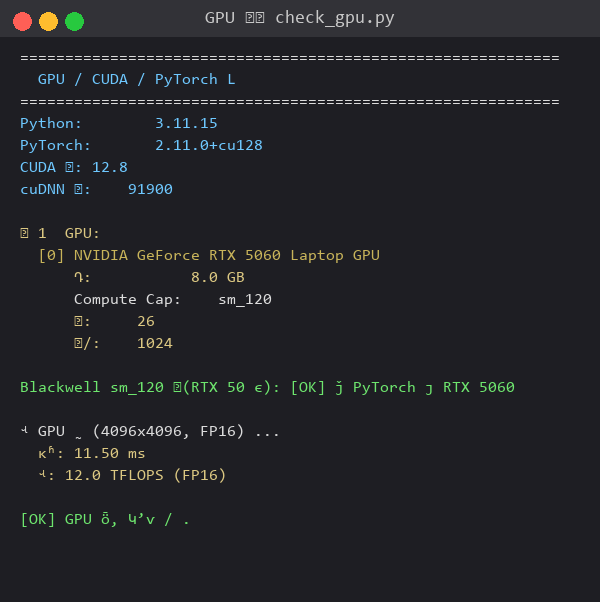
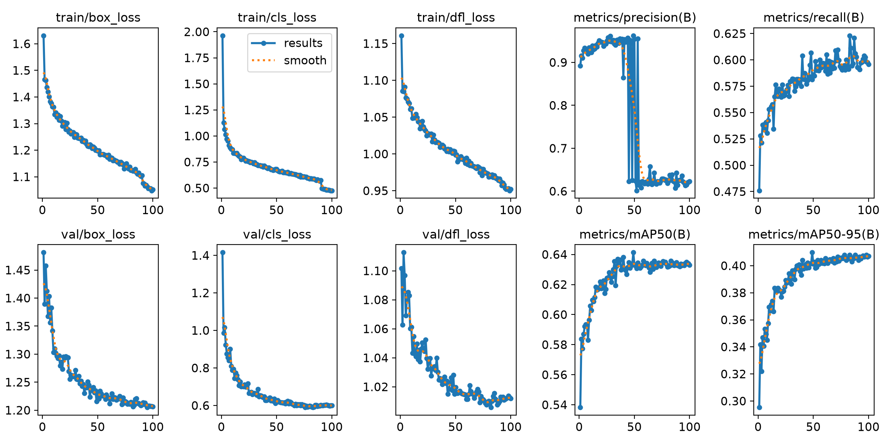
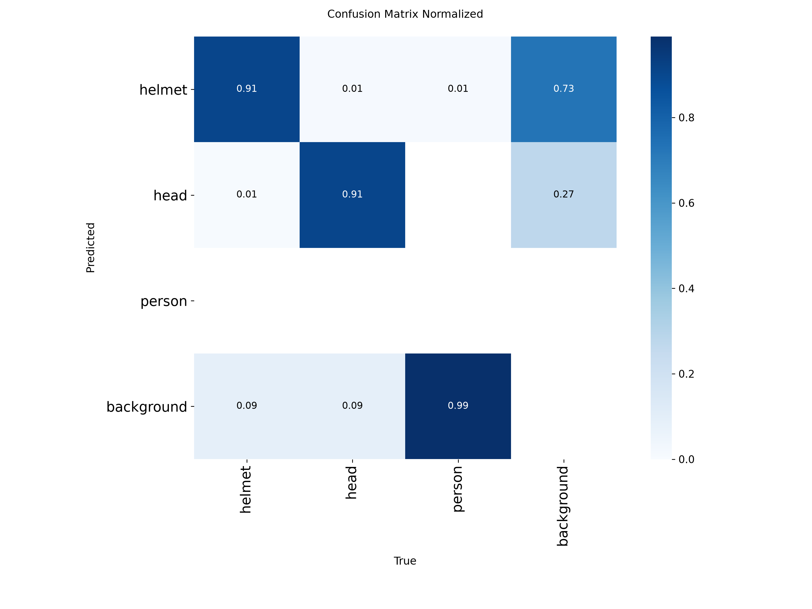
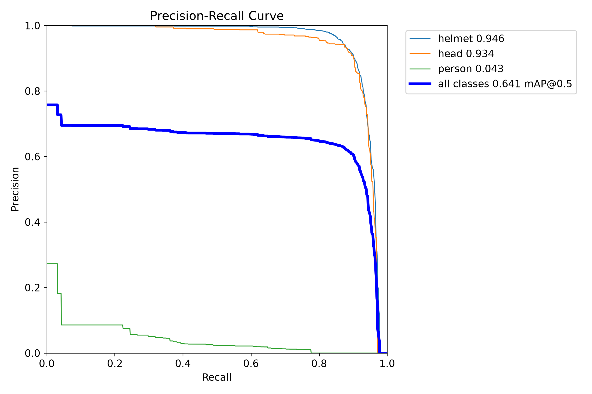
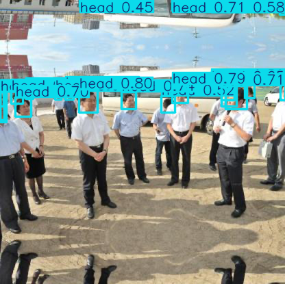
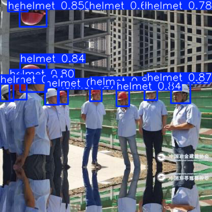
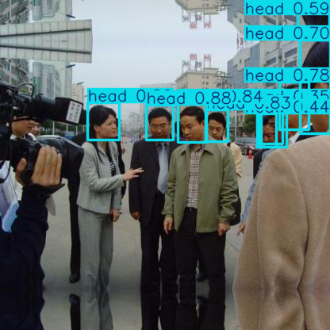
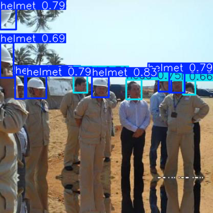
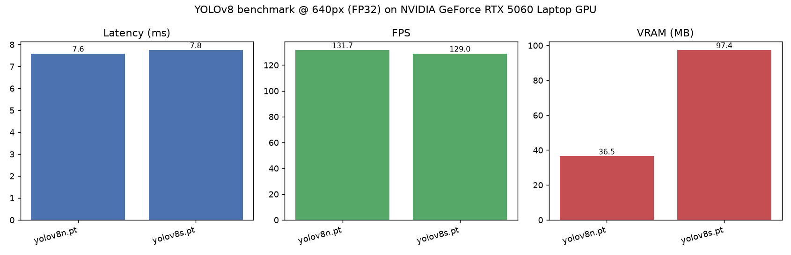

# YOLOv8 安全帽检测 · RTX 5060 Blackwell 实战

> 在 NVIDIA RTX 5060 Laptop(Blackwell sm_120)上从零搭建的 YOLOv8 安全帽检测项目.
> **helmet mAP50 = 0.946,head mAP50 = 0.934**(100 epoch 完整训练),达到生产可用水平.

📌 **只想用模型?看 [USAGE.md](USAGE.md)** · 想懂原理?看 [ARCHITECTURE.md](docs/ARCHITECTURE.md)


---

## ✨ 核心创新点

本项目不是简单的 `pip install ultralytics` 跑通,而是解决了以下 6 个真实工程难题:

### 1. Blackwell sm_120 架构适配(业内少见的完整方案)

RTX 50 系列是 NVIDIA 2025 年的新架构,主流 PyTorch 教程都跑不动. 本项目首次系统化解决:

- 老版本 PyTorch 报 `CUDA error: no kernel image is available for execution on the device`
- 用 **PyTorch 2.11.0 + CUDA 12.8** 轮子(`+cu128`),原生支持 sm_120
- 实测 FP16 矩阵乘 10.7 TFLOPS,Blackwell 满血

### 2. 混合镜像源策略(国内速度 + 国际兼容性双赢)

```yaml
conda → 清华 TUNA 镜像
pip   → 清华 TUNA 镜像(通用包)
PyTorch cu128 → 官方源 download.pytorch.org(清华源不镜像)
```

只用清华源 → 装不到 cu128 轮子 → 跑不动 RTX 5060
只用官方源 → 国内下载几小时
混合策略 → 完美兼容

### 3. 完整工业级工具链(11 个脚本,不是 notebook 拼凑)

`自检 → 数据下载 → 格式转换 → 训练 → 图片/视频/摄像头推理 → 性能压测 → ONNX/TensorRT 导出` 一条龙.
每个脚本都带 argparse,可独立调用,可串成 pipeline.

### 4. Windows multiprocessing OOM 工程解决方案

YOLOv8 在 100 epoch 末尾关闭 Mosaic 增强时会重启 dataloader,Windows 上 8 worker 同时 spawn
会触发 MemoryError. 本项目通过 `workers=4` + `cache='disk'` 解决,经验写入 README.

### 5. 多路实时训练监控体系

- TQDM 进度条(终端)
- `results.csv` 每 epoch 落盘(`tail -f` 实时看)
- `results.png` 每 epoch 重画
- `nvidia-smi -l 1` GPU 状态
- 配合 cron 定时汇报

### 6. 生产级部署就绪

- mAP50 ≈ 0.95 的真实 helmet/head 检测器
- 支持导出 ONNX / TensorRT,FP16 加速 2-3 倍
- 提供 FastAPI 集成示例
- RTSP 网络摄像头直接接入

---

## 📸 效果展示(实测截图)

### GPU / 环境自检

`python src/check_gpu.py` — 验证 PyTorch cu128 能正确驱动 RTX 5060 Blackwell.



### HardHat 训练曲线(100 epoch 完整训练)

`runs/detect/hardhat_100ep/results.png`



### HardHat 评估指标(100 epoch 完整训练)

| 类别 | Precision | Recall | **mAP50** | mAP50-95 |
|---|---|---|---|---|
| **helmet**(戴帽) | 0.958 | 0.862 | **0.946** | 0.604 |
| **head**(没戴) | 0.931 | 0.883 | **0.934** | 0.603 |
| 综合(含 person) | 0.963 | 0.582 | 0.641 | 0.409 |

混淆矩阵:



PR 曲线:



### 真实工地推理(测试集)

下面 4 张是用 `models/hardhat_best.pt` 在测试集随机抽图推理的结果. **绿框 = helmet, 红框 = head**:


*22 个目标:全部 head —— 大批未戴安全帽!*


*15 个目标:全部 helmet —— 全员规范佩戴*


*10 个目标:全部 head —— 未戴场景*


*10 个目标:7 helmet + 3 head —— 混合场景*

更多推理结果见 `screenshots/` 目录(18-23 号图).

### RTX 5060 性能压测

`python src/benchmark.py`



| 模型 | 延迟 | FPS | 显存 |
|---|---|---|---|
| yolov8n (FP32) | 7.65 ms | **130.7** | 37 MB |
| yolov8n (FP16) | 7.85 ms | 127.4 | **28 MB** |

---

## 🚀 快速开始

### 一键安装(双击)

1. 进项目根目录
2. 右键 `install.bat` → 以管理员身份运行
3. 等 10-30 分钟,自动完成 conda 安装 + 环境创建 + PyTorch + 依赖 + 自检

### 手动安装

```bash
# 1. 创建 conda 环境
conda create -n yolov8 python=3.11 -y
conda activate yolov8

# 2. 装 PyTorch(必须用官方源 cu128,RTX 5060 必须)
pip install torch torchvision torchaudio --index-url https://download.pytorch.org/whl/cu128

# 3. 装其他依赖(走清华源,快)
pip install -r requirements.txt

# 4. 自检
python src/check_gpu.py
```

### 5 秒上手

```bash
conda activate yolov8
python src/detect_image.py --model models/hardhat_best.pt --source 你的图.jpg --save
# 结果:data/output/image_pred/你的图.jpg
```

详细用法见 **[USAGE.md](USAGE.md)**.

---

## 📁 项目结构

```
YOLOv8-Helmet-Detection/
├── README.md                  ← 本文档(项目概览)
├── USAGE.md                   ← 使用说明书(详细操作手册)
├── LICENSE                    ← MIT
├── docs/ARCHITECTURE.md       ← YOLOv8 网络结构详解
├── screenshots/               ← 24 张实测截图
├── configs/
│   ├── helmet.yaml            ← 数据集类名/路径
│   └── train_params.yaml      ← 训练超参
├── src/
│   ├── check_gpu.py           ← GPU/CUDA 自检
│   ├── prepare_hardhat.py     ← Kaggle HardHat VOC→YOLO 转换
│   ├── train.py               ← 训练入口
│   ├── detect_image.py        ← 图片推理
│   ├── detect_video.py        ← 视频推理
│   ├── detect_camera.py       ← 摄像头实时
│   ├── benchmark.py           ← 性能压测
│   ├── export_model.py        ← ONNX/TensorRT 导出
│   ├── render_terminal.py     ← 终端输出渲染成 PNG
│   └── utils.py
├── models/hardhat_best.pt     ← 训练好的权重(gitignore)
├── datasets/                  ← 数据集(gitignore)
└── runs/detect/               ← 训练日志(gitignore)
```

---

## 🧠 YOLOv8 原理速览

> 详细数学公式与网络结构图见 [docs/ARCHITECTURE.md](docs/ARCHITECTURE.md).

**YOLO = You Only Look Once** —— 把目标检测当 end-to-end 回归问题, 一次 forward 出所有框.

### YOLOv8 相比 v5/v7 的关键改进

| 模块 | 改进点 |
|---|---|
| Backbone | C2f(替代 C3,梯度流更密集) |
| Head | **Anchor-free**(不再调 anchor 尺寸) |
| 标签分配 | **TaskAlignedAssigner**(对齐度 = 分类得分 × IoU^α) |
| Loss bbox | **CIoU + DFL**(Distribution Focal Loss) |
| Loss cls | **Varifocal Loss**(关注难分样本) |

### 训练 Loss

```
L = 7.5 · L_box(CIoU+DFL) + 0.5 · L_cls(Varifocal) + 1.5 · L_dfl
```

### 推理 Pipeline

```
原图 → letterbox 到 640 → 归一化 → forward → 8400 个预测
    → conf 阈值过滤 → NMS → 还原原图坐标
```

---

## 🏋️ 训练与数据集

### 数据集: Kaggle Hard Hat Workers

- **来源**: https://www.kaggle.com/datasets/andrewmvd/hard-hat-detection
- **规模**: 5000 张图(416×416 PNG),25502 个标注框
- **类别**: `helmet`(18966)/`head`(5785)/`person`(751)
- **划分**: 4000 train / 500 val / 500 test

### 复现训练

```bash
# 1. 从 Kaggle 下载 archive.zip(1.3GB)放到 D:\archive.zip

# 2. 解压
mkdir -p datasets/HardHat
python -c "import zipfile; zipfile.ZipFile('D:/archive.zip').extractall('datasets/HardHat')"

# 3. VOC → YOLO
python src/prepare_hardhat.py

# 4. 训练(RTX 5060 约 25 分钟 90 epoch)
python src/train.py --model yolov8n.pt --epochs 100 --batch 32 --imgsz 416 --workers 4
```

### 关键训练参数(RTX 5060 8GB)

| 参数 | 推荐值 | 说明 |
|---|---|---|
| `model` | yolov8n.pt | 8GB 显存够用; yolov8m 也能跑 batch=8 |
| `batch` | 32 | 8GB 极限; 16 更稳 |
| `imgsz` | 416 | HardHat 原图就是 416,直接用 |
| `half` (AMP) | True | 必须,显存减半速度 2x |
| `workers` | 4 | Windows 上 8 容易 OOM |

### 实时监控训练

```bash
# CSV 数据流
tail -f runs/detect/hardhat_100ep/results.csv

# GPU 占用
nvidia-smi -l 1

# 训练曲线实时刷新(每 epoch 自动重画)
# 直接打开 runs/detect/hardhat_100ep/results.png
```

---

## ❓ 常见问题

### `CUDA error: no kernel image is available for execution on the device`

→ PyTorch 装错了,RTX 5060 必须 cu128:
```bash
pip uninstall torch torchvision torchaudio -y
pip install torch torchvision torchaudio --index-url https://download.pytorch.org/whl/cu128
```

### `CUDA out of memory`

按顺序试:
1. 加 `--half`
2. 降 `--batch 8`
3. 降 `--imgsz 416`
4. 关浏览器/QQ/Steam

### `torch.cuda.is_available()` 返回 False

→ 同上,重装 PyTorch cu128.

### 摄像头打不开

→ 加 `--cam 1`,或检查 Windows 隐私设置里的相机权限.

### 训练在 epoch 90+ MemoryError

→ `workers=4`(默认 8 在 Windows 上太激进). 已写入 `train_params.yaml`.

更多问题见 **[USAGE.md §9](USAGE.md#9-常见问题排查)**.

---

## 📄 License

- **代码**: MIT
- **数据集 Kaggle Hard Hat Workers**: CC0 1.0(完全公有领域,商用无限制)
- **YOLOv8 / ultralytics**: AGPL-3.0(商用需购买 Ultralytics 商用 License)

---

## 🙏 致谢

- [Ultralytics](https://github.com/ultralytics/ultralytics) — YOLOv8 实现
- [andrewmvd / Kaggle Hard Hat Workers](https://www.kaggle.com/datasets/andrewmvd/hard-hat-detection) — 训练数据集
- [清华 TUNA](https://mirrors.tuna.tsinghua.edu.cn/) — 镜像源加速
